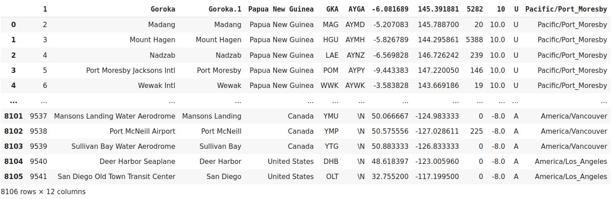

[![LinkedIn][linkedin-shield]][linkedin-url]

<!-- PROJECT LOGO -->
 

  <h3 align="center">Transform Airport Data with Pyspark</h3>

  

    Use Pyspark for transforming Airport data to Airport in Thailand data.
     
     
    <a href="https://github.com/BankNatchapol/Pyspark-Airport-Data/issues">Report Bug</a>
    ·
    <a href="https://github.com/BankNatchapol/Pyspark-Airport-Data/issues">Request Feature</a>
  

<!-- TABLE OF CONTENTS -->

  
Table of Contents

  <ol>
    <li>
      <a href="#installation">Installation</a>
    </li>
    <li>
        <a href="#dataset">Dataset</a>
    </li>

<li>
      <a href="#submitting">Submitting</a>
    <li><a href="#contact">Contact</a></li>
  </ol>

<!-- INSTALLATION -->
## Installation
you can install spark follow this link [Spark](https://spark.apache.org/downloads.html)

<!-- DATASET -->
## Dataset

<!-- SUBMITTING -->
## Submitting 
 run this command to submit airport data and get output in out folder. 
To get all airports in Thailand.
> spark-submit AirportsInThailand.py 

To get all airports that latitude > 40.
> spark-submit AirportsByLatitude.py

<!-- CONTACT -->
## Contact

Facebook - [@Natchapol Patamawisut](https://www.facebook.com/natchapol.patamawisut/)

Project Link: [https://github.com/BankNatchapol/AWS-Data-Warehouse-ETL](https://github.com/BankNatchapol/AWS-Data-Warehouse-ETL)

<!-- MARKDOWN LINKS & IMAGES -->
<!-- https://www.markdownguide.org/basic-syntax/#reference-style-links -->
[linkedin-shield]: https://img.shields.io/badge/-LinkedIn-black.svg?style=for-the-badge&logo=linkedin&colorB=555
[linkedin-url]: https://www.linkedin.com/in/natchapol-patamawisut
